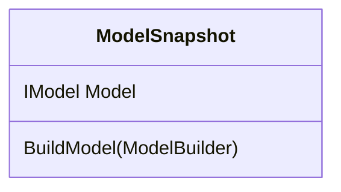

# Migrations Architecture

Migrations is the part of EF that generates DDL to create and manage relational database schemas. It can be divided into two main parts: the runtime and the design-time. The runtime components support things that can be performed at runtime such as `dbContext.Database.Migrate()` or `EnsureCreated()`. It's also the parts that get referenced by user code like the base Migration and ModelSnapshot types. The design-time components support generating new migrations and managing the migrations at design time.

## Runtime

The best way to introduce you to the runtime Migrations components is to walk you through what happens when a user calls EnsureCreated. After that, we'll go into more detail by looking at the Migration class itself and what happens when a user calls Migrate.

### EnsureCreated

Calling `dbContext.Database.EnsureCreated()` is a quick way to go from and an empty (or non-existent) database schema to one that matches your current EF model. While it bypasses most of the Migrations pipeline, it still use several of its components.

For relational providers, the logic behind EnsureCreated is in [RelationalDatabaseCreator](https://github.com/dotnet/efcore/blob/main/src/EFCore.Relational/Storage/RelationalDatabaseCreator.cs). The code for creating the database schema is essentially as follows.

```csharp
var model = context.GetService<IDesignTimeModel>().Model;
var operations = modelDiffer.GetDifferences(null, model.GetRelationalModel());
var commands = migrationsSqlGenerator.Generate(operations, model);
migrationCommandExecutor.ExecuteNonQuery(commands, connection);
```

It starts by getting the current design-time model for the DbContext. The design-time model is the same model you get from `dbContext.Model` except it still has all the information needed to create the database. We strip this information from the main runtime model since it's generally not needed.

Then, it uses the model differ to go from `null` or an empty database to the current model. The model differ returns a list of operations (e.g. create tables, add foreign keys, etc.) that need to be performed to the database schema to bring it up to date.

It then passes these operations to the Migrations SQL generator. This is a provider-specific component that generates the actual DDL statements (e.g. CREATE TABLE) that need to be sent to the database in order to perform the migration operations.

Finally, it runs the SQL in the database using the migrations command executor.

Users can also use `dbContext.Database.GenerateCreateScript()` to just get back the SQL script without actually executing it.

### Model Differ

The model differ is implemented in [MigrationsModelDiffer](https://github.com/dotnet/efcore/blob/main/src/EFCore.Relational/Migrations/Internal/MigrationsModelDiffer.cs). The main method, GetDifferences, takes a source model and a target model. It traverses the models and tries to pair up elements from the source model with the target model. It does this by calling the DiffCollection method with a series of filters that are ran in order with the strongest pairings first and the weakest pairings last. Names are the most reliable source for pairing. If the store (e.g. table and column) names are the same, they are paired up. The same is true for the conceptual (e.g. entity type and property) names. The weaker pairings are done by matching the definition of the elements. For example, if the column has the same annotations and facets specified in both models. As differences are discovered, migration operations are generated.

When the operations are generated, the provider has a chance to add additional annotations to them. This is done via the IMigrationsAnnotationProvider service.

The Sort method sorts the migration operations into a predictable order so that we can make certain assumptions when generating the operations. For example, we can assume that any renames have been performed before an alter statement.

### Migration Operations

The different kinds of migrations operations are defined in [src/EFCore.Relational/Migrations/Operations](https://github.com/dotnet/efcore/tree/main/src/EFCore.Relational/Migrations/Operations). They are based on the SQL spec and represent high-level operations that need to be performed on the database to bring its schema up to date. There is not a one-to-one mapping between an operation and the DDL it generates. It is up to the provider to figure out the exact SQL that needs to be generated.

The operations, like the EF metadata model, also allow arbitrary annotations to be added to them. This lets providers (and users) specify additional information to use during SQL generation.

### SQL Generator

The provider is responsible for turning the list of migrations operations into the exact SQL that needs to be generated. Sometimes this is a simple as generating the corresponding DDL statement for the operation. If a database honors the SQL spec, it can largely rely on the base [MigrationsSqlGenerator](https://github.com/dotnet/efcore/blob/main/src/EFCore.Relational/Migrations/MigrationsSqlGenerator.cs) implementation.

Sometimes the actual SQL is a lot more complex. For example, SQL Server needs to drop any DEFAULT constraints on a column before it can drop the column itself.

The SQL is generated using a `MigrationCommandListBuilder` object. Which facilitates grouping statements together into command batches and marking whether individual commands need to be excluded from a transaction. Some databases don't allow certain statements to be executed inside a transaction.

### Command Executor

The `IMigrationCommandExecutor` service is used to actually execute the commands against a database. It  begins and commits transacts as needed while executing the commands. If a commands needs to be outside of a transaction, it will commit any pending changes, run the command outside of a transaction, then begin a new transaction for the next command.

### Migrations

Thus far, we've looked at everything used by EnsureCreated to go from an empty database to one that matches the current database. So, what is a migration? A migration captures a set of operations to take you from one database schema to another. A migration derives from the base Migration class and overrides the Up (and Down) method to define the operations using an operation builder. Migrations also capture the target model they are creating a schema. The target model is created using a model builder by overriding the BuildTargetModel method.


The Up methods captures the steps to take the database to the target schema. The Down method captures the steps to undo those changes and go back to the starting database schema.

Notice that there's nothing in the architecture that requires users to generate these at design time using our tools. A user could write each migration from scratch by hand if they really wanted to. We'll look more at how migrations are generated at design time below.

The builders passed to the Up and Down methods provide a fluent API for creating migrations operations (the same objects created by the model differ).

Migrations specify which DbContext they are for using the DbContextAttribute.

Their ID is specified using the MigrationAttribute. An ID consists of a timestamp and a name separated by an underscore. Migrations are ordered by their ID when applied. The name can be anything and is usually used like a brief commit message would be in a source control system.

### Migrator

Once you've defined one or more migrations, you can apply them at runtime using `db.Database.Migrate()`. The logic behind this method is inside the [Migrator](https://github.com/dotnet/efcore/blob/main/src/EFCore.Relational/Migrations/Internal/Migrator.cs) class.

First, it checks whether the database exists, if it doesn't it creates a new, empty database. It also creates the migrations history table. This is a simple table used to keep track of which migrations have been applied to the database. The logic for creating and interacting with the history table is defined by the provider in a service that derives from [HistoryRepository](https://github.com/dotnet/efcore/blob/main/src/EFCore.Relational/Migrations/HistoryRepository.cs).

Then it scans the migrations assembly for all the migrations that belong to the current DbContext. By default, the migrations assembly is the same containing the DbContext, but it can also be configured to a different assembly as part of the DbContext options. (See [Using a Separate Migrations Project](xref:core/managing-schemas/migrations/projects))

After it's found all the migrations, it checks which ones have been applied to the database using the migrations history table.

Then, for any migrations that haven't been applied, it generates the migration commands and executes them against the database. Migrations are applied in the order of their ID timestamp.

On the base migrator service, there is also an option to specify a target migration. By default, this is the latest migration. When specified, the database will only be updated to that specific migration and later migrations will remain unapplied. If any migrations after the target migration have already been applied, they will be undone by executing the operations defined in their Down methods.

You can also just generate the SQL without actually executing it. This allows users and tools to produce a script.

## Design-time

Now that we've covered the runtime migrations components, let's have a look at some of the design-time components used to manage migrations.

### Tools

As described in the [Design-time Tools Architecture](xref:ore/miscellaneous/internals/tools) article, there are two main interfaces for design-time commands: the dotnet-ef CLI and the PMC commands. The following is a table of migrations-related commands.

dotnet-ef                            | PMC              | Description
------------------------------------ | ---------------- | -----------
database drop                        | Drop-Database    | Calls `dbContext.Database.EnsureDeleted()`
database update                      | Update-Database  | Calls `migrator.Migrate()`
dbcontext script                     | Script-DbContext | TODO
migrations add                       | Add-Migration    |
migrations bundle                    | Bundle-Migration |
migrations has-pending-model-changes | &nbsp;           |
migrations list                      | Get-Migration    |
migrations remove                    | Remove-Migration |
migrations script                    | Script-Migration |

IMigrationsIdGenerator
TODO

### Model Snapshot


