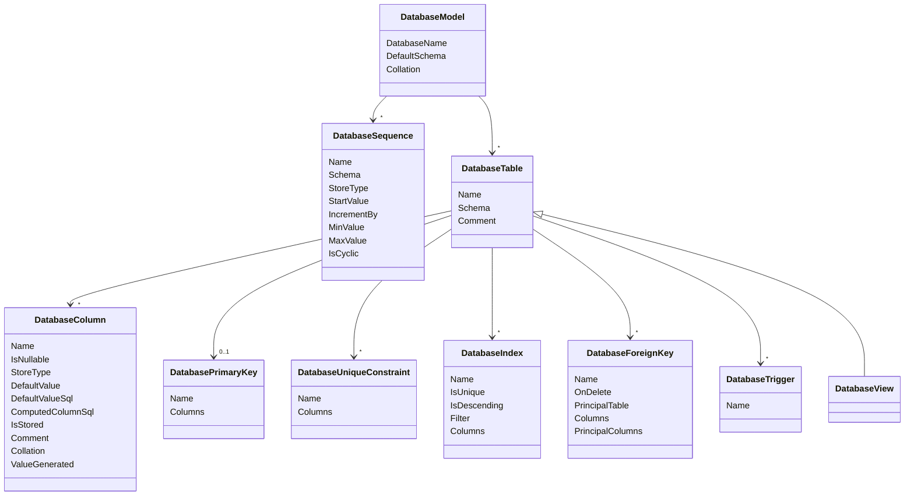

---
---
# Scaffolding Architecture

Reading database metadata
Provider code hooks (UseMyProvider, literals, etc.)

IDatabaseModelFactory

```mermaid
classDiagram
    class DatabaseModel{
        DatabaseName
        DefaultSchema
        Collation
    }
    class DatabaseSequence{
        Name
        Schema
        StoreType
        StartValue
        IncrementBy
        MinValue
        MaxValue
        IsCyclic
    }
    class DatabaseTable{
        Name
        Schema
        Comment
    }
    class DatabaseColumn{
        Name
        IsNullable
        StoreType
        DefaultValue
        DefaultValueSql
        ComputedColumnSql
        IsStored
        Comment
        Collation
        ValueGenerated
    }
    class DatabasePrimaryKey{
        Name
        Columns
    }
    class DatabaseUniqueConstraint{
        Name
        Columns
    }
    class DatabaseIndex{
        Name
        IsUnique
        IsDescending
        Filter
        Columns
    }
    class DatabaseForeignKey{
        Name
        OnDelete
        PrincipalTable
        Columns
        PrincipalColumns
    }
    class DatabaseTrigger{
        Name
    }
    DatabaseModel --> "*" DatabaseSequence
    DatabaseModel --> "*" DatabaseTable
    DatabaseTable --> "*" DatabaseColumn
    DatabaseTable --> "0..1" DatabasePrimaryKey
    DatabaseTable --> "*" DatabaseUniqueConstraint
    DatabaseTable --> "*" DatabaseIndex
    DatabaseTable --> "*" DatabaseForeignKey
    DatabaseTable --> "*" DatabaseTrigger
    DatabaseTable <|-- DatabaseView
```
